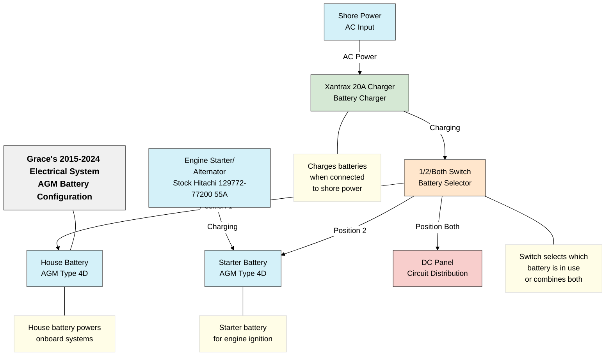

# Grace's 2015-2024 Electrical System

This document details the electrical system configuration used on Grace from 2015 to 2024, prior to the 2025 lithium battery upgrade.

## System Overview

The 2015-2024 electrical system utilized traditional AGM (Absorbed Glass Mat) batteries in a dual-battery configuration with basic charging and distribution components.

## System Components

### Power Sources
- **House Battery**: West Marine Group 4D Dual Purpose Marine AGM Battery
  - Capacity: 198Ah
  - Usable capacity: ~99Ah (50% depth of discharge)
  - Cold Cranking Amps: 1110 CCA
  - Marine Cranking Amps: 1420 MCA
  - Reserve Minutes: 380 min
  - Weight: ~120 lbs
  - Dimensions: 21" x 9" x 10"
  - Cost (April 2025): $890

- **Starter Battery**: West Marine Group 4D Dual Purpose Marine AGM Battery
  - Capacity: 198Ah
  - Cold Cranking Amps: 1110 CCA
  - Marine Cranking Amps: 1420 MCA
  - Reserve Minutes: 380 min
  - Weight: ~120 lbs
  - Dimensions: 21" x 9" x 10"
  - Cost (April 2025): $890

- **Alternator**: Stock Hitachi 129772-77200
  - Output: 55A maximum
  - Voltage: 14.4V (typical charging voltage)

- **Shore Power**: AC power connection when docked
  - Standard 30A marine shore power connection

### Battery Management
- **Battery Switch**: 1/2/Both Switch
  - Position 1: House battery only
  - Position 2: Starter battery only
  - Position Both: Batteries connected in parallel
  - Off: All power disconnected

### Charging System
- **Xantrax 20A Charger**
  - Input: 120V AC shore power
  - Output: 20A maximum charging current
  - Basic charging profile for AGM batteries

### Distribution
- **DC Panel**
  - Multiple circuit breakers for different onboard systems
  - Basic power distribution without monitoring

## System Limitations

### Power Capacity Limitations
- AGM batteries limited to 50% depth of discharge for longevity
- Effective usable capacity of ~100Ah from the house battery
- Limited runtime for high-draw devices

### Charging Limitations
- Basic charger with limited charging profile options
- No smart charging capabilities
- No remote monitoring of battery state

### Usage Limitations
- No built-in AC power when away from shore power
- Manual battery management required
- No detailed monitoring of battery health or consumption
- Batteries required replacement every 3-5 years

### Weight Considerations
- Two AGM Type 4D batteries weighed approximately 240 lbs combined
- Significant weight impact on vessel performance

## Maintenance Requirements
- Regular voltage checks
- Terminal cleaning to prevent corrosion
- Careful monitoring of discharge levels to prevent damage

## Conclusion
The 2015-2024 electrical system provided basic functionality but had significant limitations in terms of usable capacity, monitoring capabilities, and power availability when away from shore power. These limitations led to the decision to upgrade to a lithium-based system in 2025.
