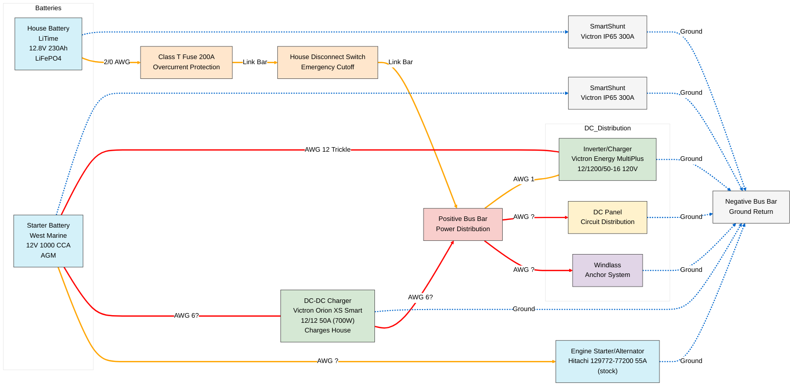

# Grace's 2025 Electrical System Upgrade

This document details the upgraded electrical system implemented on Grace in 2025, featuring lithium battery technology and enhanced monitoring capabilities.

## System Overview

The 2025 electrical system upgrade replaced the traditional AGM batteries with modern LiFePO4 (Lithium Iron Phosphate) technology, added comprehensive monitoring, and incorporated an inverter for AC power when away from shore power.

## Upgrade Motivation

The 2025 electrical system upgrade was motivated by several factors:

1. **Longer Battery Life**: LiFePO4 batteries offer 2000+ cycles compared to 300-500 for AGM batteries, reducing the frequency of replacements.
2. **Higher Capacity**: Lithium batteries provide 80-90% usable capacity compared to 50% for AGM, effectively doubling usable power.
3. **Battery Health Monitoring**: Adding SmartShunt monitors allows for precise tracking of battery state and health.
4. **AC Power Availability**: The addition of an inverter provides AC power when away from shore power.
5. **Weight Reduction**: Lithium batteries offer significant weight savings over equivalent AGM batteries.

## System Components

### Power Sources
- **LiTime 12V 230Ah LiFePO4 Deep Cycle Battery**: Main house battery providing power to all onboard systems
  - Capacity: 230Ah
  - Usable capacity: ~200Ah (90% depth of discharge)
  - Weight: ~60 lbs (half the weight of the previous AGM battery)
  - Dimensions: 19" x 6.7" x 9.5"
  - Cost (April 2025): $430
  - Meets ABYC E-13 Standard for marine applications

- **12V AGM 1000 CCA Starter Battery**: High cranking power battery dedicated to engine starting
  - Retained from previous system for engine starting reliability

- **Stock Hitachi 129772-77200 55A Alternator**: Provides power to charge both batteries when the engine is running

### Protection Devices
- **Class T Fuse 200A**: Overcurrent protection for the main battery
- **Main Disconnect Switch**: Emergency cutoff for the electrical system

### Power Distribution
- **Positive Bus Bar**: Central distribution point for positive connections
- **DC Panel**: Circuit distribution for various DC loads
- **Negative Bus Bar**: Common ground return for all components

### Power Conversion
- **Victron Energy MultiPlus Pure Sine Wave Inverter Charger, UL-Certified, 12/1200/50-16 120V VE.Bus**: Inverter/charger converting 12V DC to 120V AC (1000W)
  - Provides 120V AC power from the house battery
  - Charges the house battery when connected to shore power
  - Provides 1A trickle charge to starter battery
  - 50A charging capability
  - Cost (April 2025): $480
  - [Specifications datasheet](./specs/MultiPlus-500-1200VA-120V-EN.pdf) (Source: [Victron Energy](https://www.victronenergy.com/upload/documents/Datasheet-MultiPlus-500-1200VA-120V-EN.pdf))
  - [Full manual](./manuals/MultiPlus_500-1200VA_120Vac-manual.pdf) (Source: [Victron Energy](https://www.victronenergy.com/upload/documents/MultiPlus_12V_500-1200VA_120Vac/155314-MultiPlus_500-1200VA_120Vac-pdf-en.pdf))
  - 1200VA model chosen over 2000VA to avoid requiring larger wiring while still providing sufficient capacity for onboard needs

- **Victron Orion XS Smart 12/12 50A (700W)**: DC-DC charger that safely charges the LiFePO4 house battery from the alternator with current limiting protection
  - Protects lithium battery from alternator voltage spikes
  - Provides proper charging profile for lithium chemistry
  - [Specifications datasheet](./specs/Orion-XS-DC-DC-battery-charger-EN.pdf) (Source: [Victron Energy](https://www.victronenergy.com/upload/documents/Datasheet-Orion-XS-DC-DC-battery-charger-EN-.pdf))
  - [Full manual](./manuals/Orion_XS_DC-DC_battery_charger-manual.pdf) (Source: [Victron Energy](https://www.victronenergy.com/upload/documents/Orion_XS_12-12-50A_DC-DC_battery_charger/124067-Orion_XS_DC-DC_battery_charger-pdf-en.pdf))

### Monitoring
- **Victron Energy SmartShunt IP65 Battery Monitor (Bluetooth) - 6.5V-70V, 300 amp (House Battery)**: Monitors house battery state and power consumption
  - Tracks state of charge
  - Monitors power consumption patterns
  - Provides historical data
  - Bluetooth connectivity for monitoring via smartphone app
  - Cost (April 2025): $72
  - [Specifications datasheet](./specs/SmartShunt-IP65-EN.pdf) (Source: [Victron Energy](https://www.victronenergy.com/upload/documents/Datasheet-SmartShunt-IP65-EN-.pdf))

- **Victron Energy SmartShunt IP65 Battery Monitor (Bluetooth) - 6.5V-70V, 300 amp (Starter Battery)**: Monitors starter battery state and charging
  - Cost (April 2025): $72

### Loads
- **Windlass**: Anchor system
- **Engine Starter**: Starts the engine (part of the alternator unit)
- **Various DC Loads**: Navigation equipment, lighting, pumps, etc.
- **AC Loads**: Devices powered through the inverter when away from shore power

## Power Flow

### When Engine is Off
- House battery powers all onboard systems through the positive bus bar
- Inverter/charger provides 120V AC power from the house battery
- SmartShunts monitor power consumption and battery state

### When Engine is Running
- Alternator charges the starter battery directly
- DC-DC charger safely charges the house battery from the alternator with current limiting protection
- Both batteries provide power to their respective systems

### When Connected to Shore Power
- Inverter/charger charges the house battery at 50A
- Inverter/charger provides a 1A trickle charge to the starter battery via 14 AWG wire
- AC power is provided directly from shore power
- DC systems continue to run from the house battery

## Wiring
- **Positive Connections**:
  - 2/0 AWG: House battery to fuse
  - Link Bar: Fuse to disconnect switch to positive bus bar
  - AWG 1: Positive bus bar to inverter
  - AWG 12: Inverter to starter battery (1A trickle charge)
  
- **Negative/Ground Connections**:
  - All components connect to the negative bus bar for a common ground

## Benefits of the Upgrade

### Increased Capacity
- 230Ah lithium battery with 90% usable capacity provides ~200Ah of usable power
- Previous 200Ah AGM with 50% usable capacity provided only ~100Ah
- Effectively doubled usable power capacity

### Extended Battery Life
- LiFePO4 batteries typically last 2000+ cycles at 80% depth of discharge
- AGM batteries typically last 300-500 cycles at 50% depth of discharge
- Significantly reduced replacement frequency and lifetime cost

### Enhanced Monitoring
- Real-time monitoring of battery state and health
- Historical data tracking for power consumption analysis
- Early warning of potential issues

### AC Power Availability
- 1200W inverter provides AC power when away from shore power
- Enables use of AC devices without running a generator
- Improves comfort and functionality when cruising

### Weight Reduction
- Lithium battery weighs approximately half as much as the equivalent AGM battery
- Reduced weight improves vessel performance and fuel efficiency

## Alternatives Considered

During the planning and implementation of the 2025 electrical system upgrade, several alternative approaches were considered:

### Higher Capacity Inverter/Charger
- 2000VA Charger/Inverter was considered based on other C320 installations
- Would require much larger gauge cabling for the inverter function
- Doubling up wiring was deemed not ideal
- High wattage loads (hair dryer, electric cooking) are unlikely to be needed
- The 1200VA model provided sufficient capacity while allowing for more manageable wiring

### Charger Placement
- Some installations place inverter/chargers closer to batteries to shorten DC runs
- This approach requires longer AC runs
- Decision to keep shore charger far from batteries due to ventilation concerns
- Current placement re-uses the "stock" location for the charger, making it more obvious for future owners
- This placement balances wire gauge requirements with easy ventilation

### Starter Battery Options
- Lithium starter battery was considered
- Would require new alternator with external regulation and protection
- Currently using previous 4D AGM battery
- Future plan to replace with smaller Optima 34M BlueTOP 800 CCA starter

### DC-DC Charger Options
- Smaller amperage Victron Orion-TR series chargers were considered
- 20A would probably be sufficient for most charging needs
- Chose the newer XS series (50A) for better efficiency and improved monitoring capabilities
- XS series provides more headroom for faster charging when needed

### Solar Charging
- Option to add solar charging capability to support longer trips
- Not implemented in the initial upgrade but considered for future expansion
- Uncertainty about whether solar should charge house or starter battery
- Probably best to charge house battery when anchored ("on the hook")

### Dual Lithium House Bank
- Originally planned to do a like-for-like AH swap out at 200AH and support a dual battery bank
- This would quadruple capacity and require getting a new smaller starter battery
- Opted for single larger lithium bank in the current implementation

## Conclusion
The 2025 electrical system upgrade significantly improved Grace's power capabilities through the adoption of lithium battery technology, enhanced monitoring, and the addition of inverter functionality. These improvements provide longer battery life, increased usable capacity, better monitoring, and AC power availability when away from shore power.
