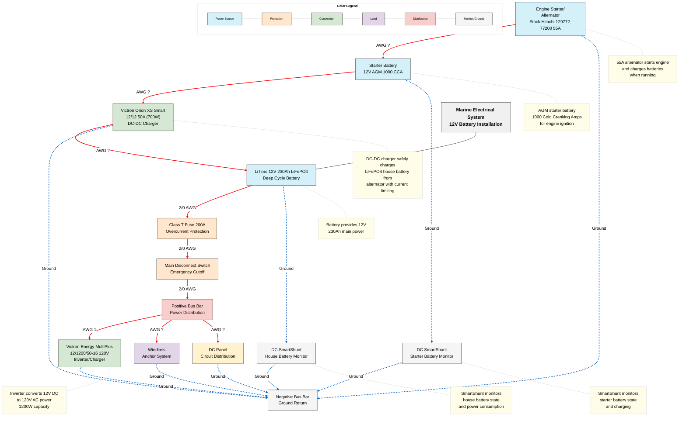

# Marine Electrical System - 12V Battery Installation

This diagram illustrates a comprehensive marine electrical system with dual batteries (house and starter), showing all components, connections, and specifications.

## System Components

### Power Sources
- **LiTime 12V 230Ah LiFePO4 Deep Cycle Battery**: Main house battery providing power to all onboard systems
- **12V AGM 1000 CCA Starter Battery**: High cranking power battery dedicated to engine starting
- **Stock Hitachi 129772-77200 55A Alternator**: Provides power to charge both batteries when the engine is running

### Protection Devices
- **Class T Fuse 200A**: Overcurrent protection for the main battery
- **Main Disconnect Switch**: Emergency cutoff for the electrical system

### Power Distribution
- **Positive Bus Bar**: Central distribution point for positive connections
- **DC Panel**: Circuit distribution for various DC loads
- **Negative Bus Bar**: Common ground return for all components

### Power Conversion
- **Victron Energy MultiPlus 12/1200/50-16 120V**: Inverter/charger converting 12V DC to 120V AC (1200W)
- **Victron Orion XS Smart 12/12 50A (700W)**: DC-DC charger that safely charges the LiFePO4 house battery from the alternator with current limiting protection

### Monitoring
- **DC SmartShunt (House Battery)**: Monitors house battery state and power consumption
- **DC SmartShunt (Starter Battery)**: Monitors starter battery state and charging

### Loads
- **Windlass**: Anchor system
- **Engine Starter**: Starts the engine (part of the alternator unit)

## Power Flow

### When Engine is Off
- House battery powers all onboard systems through the positive bus bar
- Inverter/charger provides 120V AC power from the house battery

### When Engine is Running
- Alternator charges the starter battery directly
- DC-DC charger safely charges the house battery from the alternator with current limiting protection
- Both batteries provide power to their respective systems

## Wiring
- **Positive Connections** (Red Lines):
  - 2/0 AWG: House battery to fuse to disconnect to positive bus bar
  - AWG 1: Positive bus bar to inverter
  
- **Negative/Ground Connections** (Blue Dotted Lines):
  - All components connect to the negative bus bar for a common ground

## Notes
This diagram was created using Mermaid, a JavaScript-based diagramming tool that renders Markdown-inspired text definitions to create diagrams dynamically. The diagram uses color-coding to identify component types and connection types.
